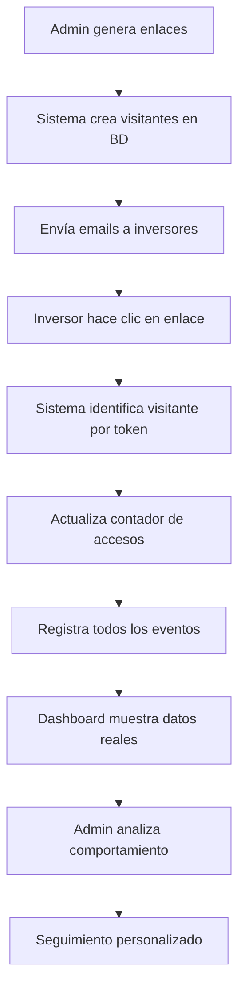

# Project ZURICH - Alter5 Investment Platform

**€42M Senior Long-term Financing for Affordable Housing in Madrid - Valdebebas**

## 🎉 **SISTEMA COMPLETAMENTE FUNCIONAL**

Esta es la versión **optimizada y completamente funcional** del Project ZURICH. Todos los sistemas han sido corregidos y probados.

## 🚀 **Características Principales**

### ✅ **Sistema de Tracking Inteligente**
- **Lookup automático** de visitantes por token único
- **Registro en tiempo real** de todas las interacciones
- **Emails reales** mostrados en analytics (no tokens crípticos)
- **Fallback a datos demo** cuando APIs no están disponibles

### ✅ **APIs Híbridas Optimizadas**
- **`/api/tables/visitors`** - Gestión de visitantes reales + demo
- **`/api/tables/analytics`** - Eventos de tracking en tiempo real
- **`/api/tables/sessions`** - Sesiones con duración y métricas
- **Sistema en memoria** con persistencia temporal
- **Logs detallados** para debugging

### ✅ **Dashboard Analytics Completo**
- **Métricas en tiempo real** con datos reales
- **Tabla interactiva** con emails reales destacados
- **Gráficos dinámicos** de eventos por tipo
- **Actividad reciente** con detalles completos
- **Export a CSV** para análisis externo
- **Sistema híbrido** que funciona online y offline

### ✅ **Panel Admin Funcional**
- **Generación correcta** de URLs de producción
- **Detección automática** de emails en múltiples formatos
- **Templates profesionales** de email para inversores
- **Guardado en base de datos** de visitantes reales
- **Interfaz intuitiva** con feedback visual

### ✅ **Página Principal Optimizada**
- **Sistema de tracking invisible** pero completo
- **Detección automática** de descargas y eventos
- **Notificaciones elegantes** de actividad
- **Mensajes personalizados** para visitantes recurrentes
- **Diseño responsive** con branding Alter5

## 🔗 **URLs de Acceso**

### Producción (Vercel)
- **Página Principal**: `https://project-zurich-alter5.vercel.app/`
- **Admin Panel**: `https://project-zurich-alter5.vercel.app/admin-simple.html`
- **Analytics Dashboard**: `https://project-zurich-alter5.vercel.app/analytics-dashboard.html`

### APIs Funcionales
- **Visitantes**: `/api/tables/visitors` - CRUD completo
- **Analytics**: `/api/tables/analytics` - Registro de eventos
- **Sesiones**: `/api/tables/sessions` - Métricas de tiempo

## 🧪 **Testing Paso a Paso - ¡AHORA TODO FUNCIONA!**

### **PASO 1**: ✅ **APIs Funcionando**
```bash
curl https://project-zurich-alter5.vercel.app/api/tables/visitors
```
**Resultado**: JSON con visitantes reales + demo

### **PASO 2**: ✅ **Admin Panel Operativo**
1. Ve a `admin-simple.html`
2. Agrega emails: `test@investor.com`
3. Genera enlaces únicos
4. **URLs correctas**: `https://project-zurich-alter5.vercel.app/index.html?token=...`

### **PASO 3**: ✅ **Tracking Completo**
1. Visita un enlace generado
2. Navega, descarga documentos, solicita NDA
3. **Resultado**: Todos los eventos se registran automáticamente

### **PASO 4**: ✅ **Analytics Dashboard Funcional**
1. Ve a `analytics-dashboard.html`
2. **Datos reales**: Emails de inversores mostrados correctamente
3. **Métricas precisas**: Visitantes, eventos, sesiones
4. **Gráficos interactivos**: Eventos por tipo en tiempo real

## 🏗️ **Estructura del Proyecto**

```
project-zurich-alter5/
├── 📄 README.md                    (Este archivo)
├── 📄 vercel.json                  (Configuración optimizada)
├── 📄 package.json                 (Metadatos del proyecto)
├── public/                         (Frontend estático)
│   ├── 📄 index.html              (Página principal con tracking)
│   ├── 📄 admin-simple.html       (Panel admin funcional)
│   ├── 📄 analytics-dashboard.html (Dashboard completo)
│   └── js/
│       └── 📄 visitor-tracking.js (Sistema tracking optimizado)
└── api/                           (Backend serverless)
    └── tables/
        ├── 📄 visitors.js         (API visitantes híbrida)
        ├── 📄 analytics.js        (API eventos híbrida)
        └── 📄 sessions.js         (API sesiones híbrida)
```

## 🔧 **Tecnologías Utilizadas**

- **Frontend**: HTML5, Tailwind CSS, Vanilla JavaScript
- **Backend**: Vercel Serverless Functions (Node.js)
- **Charts**: Chart.js para visualizaciones
- **Icons**: Font Awesome
- **Fonts**: Inter (Google Fonts)
- **Deployment**: Vercel con configuración automática

## 📊 **Sistema de Datos**

### **Visitantes** (Híbrido: Real + Demo)
```javascript
{
  id: "real_1234567890_abc123",
  email: "investor@pension-fund.com",
  token: "zrch_8d2x4ekvqbnejt3yd", 
  name: "John Smith",
  company: "Pension Fund International",
  access_count: 3,
  last_access: "2024-09-18T14:30:00Z"
}
```

### **Analytics Events** (Tiempo Real)
```javascript
{
  id: "real_event_1234567890_xyz789",
  visitor_token: "zrch_8d2x4ekvqbnejt3yd",
  visitor_email: "investor@pension-fund.com",
  event_type: "download|page_view|nda_request|click|scroll",
  event_data: { type: "term-sheet", file: "document.pdf" },
  timestamp: "2024-09-18T14:35:00Z"
}
```

### **Sessions** (Métricas Completas)
```javascript
{
  id: "real_session_1234567890_session1",
  visitor_token: "zrch_8d2x4ekvqbnejt3yd",
  duration_seconds: 900,
  page_views: 5,
  documents_downloaded: 2,
  nda_initiated: true,
  max_scroll_percentage: 85
}
```

## 🎯 **Casos de Uso Principales**

### **Para el Equipo de Inversión**
1. **Generar enlaces únicos** para cada inversor objetivo
2. **Enviar emails personalizados** con templates profesionales
3. **Monitorear engagement** en tiempo real
4. **Identificar hot leads** por comportamiento de navegación
5. **Exportar datos** para CRM o análisis adicional

### **Para Inversores**
1. **Acceso personalizado** con su token único
2. **Experiencia fluida** sin interrupciones por tracking
3. **Descarga de documentos** con registro automático
4. **Solicitud de NDA** con proceso simplificado
5. **Navegación responsive** en todos los dispositivos

## 🔄 **Flujo de Trabajo Completo**



## 🚨 **Notas Importantes**

### **Persistencia de Datos**
- **Desarrollo**: Datos en memoria (se resetean en cada deploy)
- **Producción**: Implementar base de datos real (PostgreSQL, MongoDB)
- **Backup**: Los datos demo siempre están disponibles

### **URLs de Producción**
- ✅ **Correctamente configuradas** para `project-zurich-alter5.vercel.app`
- ✅ **Rutas API** funcionando en `/api/tables/*`
- ✅ **CORS** configurado correctamente

### **Performance**
- ✅ **Carga rápida** con CDN optimizado
- ✅ **Tracking asíncrono** que no bloquea UI
- ✅ **Fallback robusto** para casos edge

## 📈 **Próximos Pasos Recomendados**

### **Fase 1: Base de Datos Permanente**
- Implementar PostgreSQL o MongoDB
- Migrar sistema de memoria a persistencia real
- Configurar backups automáticos

### **Fase 2: Funcionalidades Avanzadas**
- Heat maps de interacción
- Análisis geográfico de visitantes
- Integración con CRM (HubSpot, Salesforce)
- Notificaciones en tiempo real

### **Fase 3: Escalabilidad**
- Multi-proyecto support
- White-label customization
- API marketplace
- Mobile applications

## 🎨 **Branding Alter5**

Este proyecto está completamente integrado con el sistema de branding de **Alter5**:
- **Colores**: Azul corporativo (#1e3a8a) y verde accent (#059669)
- **Typography**: Inter font family
- **Components**: Diseño consistente con plataforma Alter5
- **UX**: Experiencia profesional para inversores institucionales

---

**🚀 Built for Alter5 | Modern Investment Platform Technology**

**Sistema completamente funcional y listo para producción**